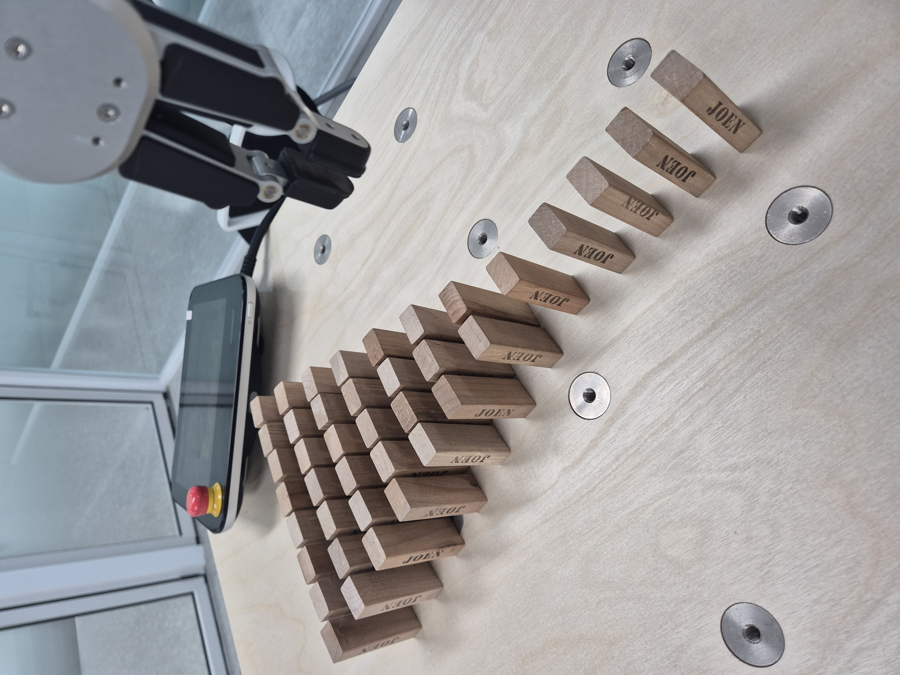
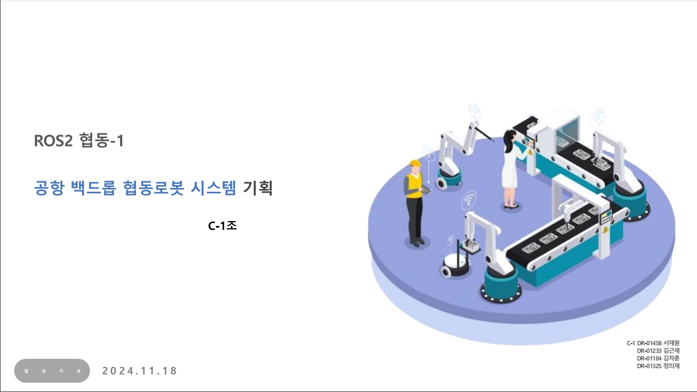

# 2주차: DART 플랫폼(두산로보틱스)을 활용한 협동로봇 동작 운영 실습

## 1. DART 플랫폼을 활용한 협동로봇 동작 운영 실습

### ✅ DART 플랫폼 개요
- DART Studio 및 DART-Platform 설치 및 설정
- 협동로봇과 DART-Platform 간의 연결 설정(IP 주소 및 네트워크 구성)
- 기본적인 Task Builder 및 Task Writer 활용 방법

### 🛠️ 실습 내용
1. **기본 조작 실습**
   - 조인트 이동(`Move J`), 선형 이동(`Move L`) 실습
   - 원호 이동(`Move C`) 및 나선형 이동(`Move Spiral`) 실습
   - 비동기 모션(`Move Periodic`)을 활용한 왕복 동작 실습
이 실습에서는 다음과 같은 내용을 학습하였습니다.
   - 충돌 감지 민감도 조정 및 충돌 방지 실습
   - 안전 정지 모드(STO, SS1, SS2) 및 비상 정지 버튼 실습
   - 안전 I/O(Safety I/O) 설정 및 테스트

4. **스레드(Thread) 및 병렬 작업**
   - `Run Thread` 및 `Kill Thread`를 활용한 멀티태스킹 구현
   - 병렬로 실행되는 작업(Thread)을 활용한 프로그램 작성
   - 실시간 신호 입력을 기반으로 하는 자동 응답 기능 추가

5. **순응제어(Compliance Control) 및 힘 제어(Force Control)**
   - 외력에 따른 순응제어 설정 및 적용
   - 힘 감지 및 자동 보정 로직 구현
   - 순응제어와 힘제어를 조합하여 정밀 작업 수행

---

## 2. DART Studio를 활용한 협동로봇 동작 운영 실습

### ✅ DART Studio 개요
- **DART Studio 설치 및 설정**  
- **협동로봇과 DART Studio 간의 연결 설정** (IP 주소 및 네트워크 구성)  
- **기본적인 Task Builder 및 Task Writer 활용 방법**  
- **로봇 모니터링 및 실시간 데이터 분석 기능 학습**  
- **DRL(Doosan Robotics Language)을 활용한 스크립트 프로그래밍 개요**  

### 🛠️ **실습 내용**

#### **1. 기본 조작 실습**
- **DART Studio UI 구성 학습 및 로봇 연결 설정**
- **관절 이동(Joint Motion) 및 선형 이동(Linear Motion) 실습**
- **모니터링 창을 활용한 실시간 데이터 분석**
  - **X축:** 시간(밀리초) / **Y축:** 데이터값(관절 각도, 속도 등)
  - **100ms 단위 실시간 데이터 업데이트 방식 학습**

#### **2. Onrobot RG2 그리퍼 설정 및 활용**
- **Onrobot RG2 그리퍼 설치 및 설정**
- **Grip 및 Release 동작 실습**
- **힘 조절 및 속도 설정 적용**
- **Pick & Place 작업에 RG2 그리퍼 적용 및 자동화**

#### **3. Script 기반 기어 조립 실습**
- **기어 조립을 위한 스크립트 작성 및 실행**
- **Task Writer 활용하여 기어 배치 자동화**
- **반복문(`Repeat` / `for` / `while`)을 활용한 작업 최적화**
- **조건문(`if` / `else`)을 적용하여 작업 오류 검출 및 예외 처리**

#### **4. Script 기반 Pattern Pallet 실습**
- **Pattern Pallet 개념 학습 및 적용**
- **Pick & Place 알고리즘을 활용한 패턴 배치 프로그래밍**
- **반복 동작을 통해 최적의 배치 알고리즘 구현**
- **작업 영역 제한 및 안전 기능 적용**

---
### 🏆 실습 결과물
<table>
  <tr>
    <td align="center">
      
       <b>Move C on Gear</b> 
    </td>
    <td align="center">
      
       <b>Domino</b> 
    </td>
  </tr>
</table>

## 3. 공항 백드롭 협동로봇 시스템 기획

프로젝트는 **공항 백드롭 자동화 시스템**을 구축하여 승객의 수하물 처리를 효율적으로 개선하는 것을 목표로 합니다.

### 발표 자료 

### 📌 프로젝트 개요
- **프로젝트명**: 공항 백드롭 협동로봇 시스템
- **발표일**: 2024.12.02
- **팀명**: C-1조
- **팀원**: 서재원, 김근제, 김차훈, 정의재

### 🎯 프로젝트 목표
- 공항 내 **자동화 수하물 처리 시스템** 구축
- **운송 속도 개선** 및 **처리 효율 극대화**
- **정확한 무게 측정 및 스티커 자동 부착 기능** 도입
- **최소한의 인력 개입**으로 운영 비용 절감

### ⚙️ 시스템 개요
#### ✅ 주요 기능
- **고객이 지정 위치에 캐리어를 배치**
- **AI 기반 센서를 이용한 캐리어 감지 및 자동 리프팅**
- **실시간 무게 측정 및 적절한 위치로 이동**
- **자동 스티커 부착 후 컨베이어 벨트로 이동**

### 💡 기대 효과
✅ **수하물 처리 속도 증가** 및 **승객 대기 시간 단축**  
✅ **운영 비용 절감** 및 **공항 직원 부담 완화**  
✅ **실시간 상태 모니터링**으로 오류 발생 최소화  
✅ **미래 확장 가능성** (추가 기능 및 타 공항 도입)

### 🔥 리스크 관리
- **센서 오작동 문제** → 정기적 유지보수 및 자동 보정 기능 추가
- **데이터 누락 발생 가능성** → 클라우드 기반 로그 시스템 구축
- **로봇 운영 안전성 확보** → 비상 정지 기능 및 충돌 방지 센서 적용
